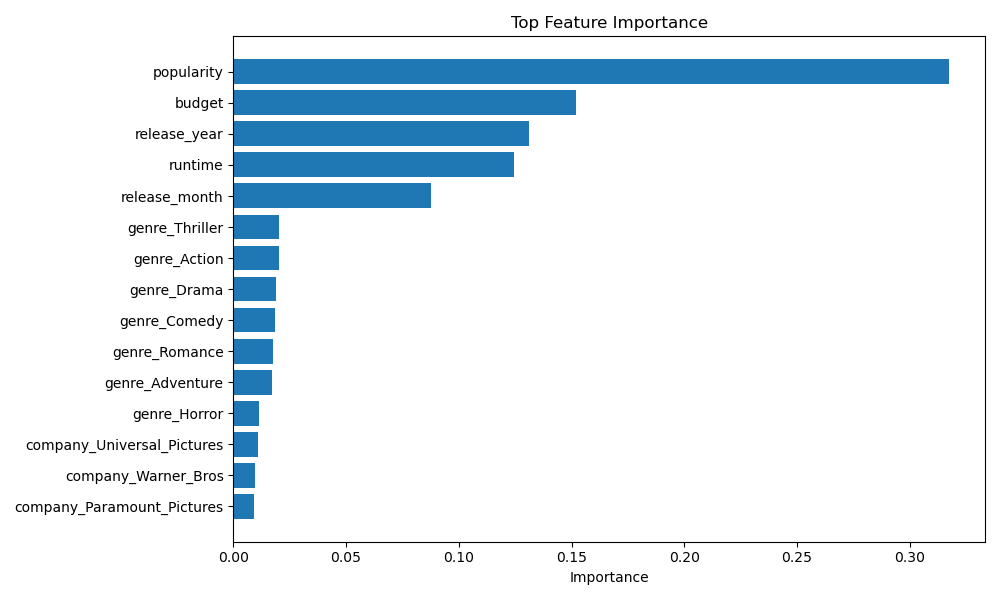
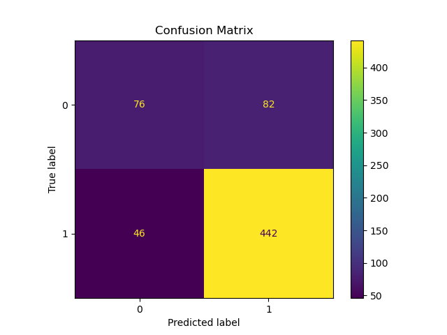

# 🎬 Movie Success Prediction using Machine Learning

## 📌 Overview
This project builds an **end-to-end Machine Learning pipeline** to predict:

- 🎯 **Hit vs Flop (Classification)**
- 📈 **Movie ROI (Regression)**

using pre-release metadata such as budget, directors, production companies, genres, and release timing.

The goal is to simulate how studios or investors could **estimate movie performance before release** using historical data.

---

## 🚀 Problem Statement
Movie production involves multi-million dollar investments.  
Studios need early signals to answer:

👉 *Will this movie likely succeed or fail?*

We frame this as:

- Binary classification → Hit (1) / Flop (0)
- Regression → ROI prediction

---

## 📂 Dataset
**Source:** TMDB 5000 Movies Dataset

Merged:
- `tmdb_movies.csv`
- `tmdb_credits.csv`

Includes:
- budget
- revenue
- cast & crew (JSON)
- production companies
- genres
- release dates
- metadata

---

## 🧹 Data Engineering & Feature Engineering

### Cleaning
- Removed noisy text columns (overview, homepage, tagline)
- Handled missing values
- Removed zero budget/revenue rows
- Converted release date → year/month
- Merged movies + credits datasets

### JSON Parsing
Extracted structured features from nested JSON:
- directors
- production companies
- genres

### Leakage Prevention ⚠️
Removed post-release columns:
- revenue
- profit
- ROI
- vote counts
- ratings

(Prevented unrealistic 100% accuracy)

### Engineered Features
- Top director indicators
- Major production companies
- Genre encoding
- Budget log transform
- Release year/month

---


---

## ⚙️ Models Used

### Classification
- Logistic Regression
- Random Forest
- Gradient Boosting

### Regression
- Linear Regression
- Random Forest Regressor
- Gradient Boosting Regressor

---

## 🔧 Model Optimization
- 5-Fold Cross Validation
- GridSearchCV Hyperparameter Tuning

---

## 📊 Results

### 🔹 Feature Importance


### 🔹 Confusion Matrix


---

## 🛠️ Tech Stack
- Python
- Pandas
- NumPy
- Scikit-learn
- Matplotlib

---

## ▶️ How to Run

### 1️⃣ Install dependencies
```bash
pip install -r requirements.txt
```
### 2️⃣ Run pipeline
```
python src/preprocess.py
python src/features.py
python src/train_classifier.py
python src/train_regressor.py
```
### Optional tuning
```
python src/tune_classifier.py
python src/tune_regressor.py
```

---

## 💡 Key Learnings
- Handling messy real-world JSON data
- Preventing feature leakage
- Feature engineering from metadata
- Building modular ML pipelines
- Model evaluation & tuning
- Converting notebooks → production scripts

---
## 👩‍💻Author
Anusha Nagula